# Learn the Code — structs, threads, locks, networks, TLS (from zero)

You did not write every line by hand, and that is fine — this file exists
so the code becomes *yours* anyway. Read top to bottom. Nothing here
assumes you know anything beyond basic C (`if`, loops, functions).

Rule of C that makes everything below click: **nothing happens by magic.
Every line does one explicit thing.** When confused, ask: "what bytes,
where?"

Diagrams are [Mermaid](https://mermaid.js.org/) — they render as pictures
on GitHub. Memory layouts are ASCII boxes (mermaid cannot draw those).

---

## Part 1 — Structs from zero

### 1.1 Why structs exist

Without structs, related data drifts apart:

```c
char *host1 = "a.com", *host2 = "b.com";
int   port1 = 80,      port2 = 443;   /* which port belongs to which? */
```

A struct **glues variables into one named box** so they travel together:

```c
struct address {
    char *host;
    int   port;
};

struct address a;
a.host = "a.com";
a.port = 80;
```

`struct address` is a new *type*. `a` is one *variable* of that type.
`a.host` reaches inside with the **dot operator**.

### 1.2 What lives in memory

```
struct address a;          memory (simplified):

                       +--------------+
           a.host  --> |  "a.com"     |  8 bytes (a pointer = an address)
                       +--------------+
           a.port  --> |      80      |  4 bytes (an int)
                       +--------------+
```

A struct is just its fields laid out back-to-back. `sizeof(struct
address)` = sum of fields (plus possible invisible *padding* bytes the
compiler inserts so each field sits at a "comfortable" address —
know the word exists, ignore it otherwise).

### 1.3 `typedef` — giving the struct a short name

```c
typedef struct cache_element {   /* long name, needed inside (see 1.6) */
    char *data;
    ...
} cache_element;                 /* short name, usable from here on */
```

After this, `cache_element *p;` works instead of the mouthful
`struct cache_element *p;`. Two names, one type. That is all `typedef`
ever does.

### 1.4 Pointers to structs and `->`

Functions usually receive a *pointer* to a struct (passing the whole
box by value would copy it — slow and edits wouldn't stick):

```c
void print_addr(struct address *a) {
    printf("%s %d\n", (*a).host, (*a).port);  /* clunky */
    printf("%s %d\n", a->host, a->port);      /* same thing, short */
}
```

**`a->host` means exactly `(*a).host`**: "follow the pointer, take the
field." Every `pr->host`, `e->next` in this project is that.

### 1.5 Structs holding pointers (who frees what?)

```c
struct address a;
a.host = x_strdup("a.com");   /* heap copy owned by a */
...
free(a.host);                 /* owner pays the debt */
```

Rule used everywhere here: **whoever `strdup`/`malloc`s owns the bytes
and must `free` them.** `ParsedRequest_destroy` is one long list of
exactly these paybacks.

### 1.6 The self-pointer → linked list

A struct can hold a pointer to *its own type* (inside the braces you
must still write the long `struct` name — the short one doesn't exist
yet):

```c
typedef struct node {
    int          value;
    struct node *next;   /* address of another node (or NULL = end) */
} node;
```

Three nodes chained:

```
+-------+     +-------+     +-------+
| val 5 |     | val 9 |     | val 2 |
| next -----> | next -----> | next -----> NULL
+-------+     +-------+     +-------+
  head
```

To visit all: `for (node *e = head; e; e = e->next)`. To add at front:
`new->next = head; head = new;`. That is 90% of `cache_store()`.
Removing from the middle needs the *previous* node too (see
`victim_prev` in `cache_evict_lru_locked`) — draw it on paper once and
it sticks forever.

### 1.7 Array of structs vs linked list

- **Array** (`headers[i]`): slots side by side, instant `headers[3]`
  access, but fixed size → we *grow* it by doubling (`realloc`).
- **Linked list** (cache): grows one node at a time, no doubling, but
  reaching node N means walking N links.

The project uses both, each where it fits.

---

## Part 2 — Every struct in this project, field by field

### 2.1 `ParsedHeader` — one `Key: Value` line

```c
typedef struct ParsedHeader {
    char  *key;            size_t key_length;
    char  *value;          size_t value_length;
} ParsedHeader;
```

For the header `Host: example.com`: `key` → `"Host"`, `value` →
`"example.com"`, lengths cached so nobody re-scans with `strlen`.
Nothing more. (Why two length fields? Speed only — could recompute.)

### 2.2 `ParsedRequest` — the whole split request

Take this request off the wire:

```
GET http://example.com:8080/index.html HTTP/1.1\r\n
Host: example.com\r\n
Connection: close\r\n
\r\n
```

After `ParsedRequest_parse`, the struct holds:

```
method   = "GET"
protocol = "http"
host     = "example.com"
port     = "8080"            (NULL would mean "default")
path     = "/index.html"
version  = "HTTP/1.1"
raw_request_line = "GET http://example.com:8080/index.html HTTP/1.1"
headers  = [ {"Host","example.com"}, {"Connection","close"} ]
headers_in_use = 2,  headers_capacity = 4
```

`headers_in_use` vs `headers_capacity`, drawn:

```
slots:    [0]        [1]          [2]   [3]
        +----------+------------+-----+-----+
        | Host:... | Conn:close | ??? | ??? |
        +----------+------------+-----+-----+
         ^^^^^^^^^^^^^^^^^^^^^^^
           in_use = 2             capacity = 4
```

Appending a 5th header would first double capacity to 8
(`ensure_header_capacity`). `raw_request_line` exists because the
tokenizer *writes into* the string it splits — so we tokenize our own
copy, never the caller's buffer.

### 2.3 `cache_element` — one cached response

```c
typedef struct cache_element {
    char                 *data;  /* raw response bytes (the whole reply) */
    int                   len;   /* how many bytes                       */
    char                 *url;   /* key, e.g. "https://h:443/p"          */
    time_t                lru;   /* last-used time (a big integer)       */
    struct cache_element *next;  /* next entry, NULL at the end          */
} cache_element;
```

Two cached pages in memory:

```
cache_head
   |
   v
+--------------------------------+     +--------------------------------+
| url "http://a:80/x"            |     | url "https://b:443/y"          |
| len 412   lru 17100            |     | len 900   lru 17050  (older!)  |
| data [H][T][T][P]... (412 B)   |     | data [...] (900 B)             |
| next ----------------------------+---> next ---> NULL                |
+--------------------------------+     +--------------------------------+
```

When space runs out, the entry with the **smallest `lru`** (here
`https://b:443/y`) is evicted first. Every hit refreshes `lru` to now.

### 2.4 `upstream_t` — "a connection, maybe encrypted"

```c
typedef struct {
    sock_t fd;
    SSL   *ssl;   /* NULL → plain HTTP, otherwise a live TLS session */
} upstream_t;
```

Two states, same verbs (`upstream_connect/send/recv/close`):

```
plain:   fd = 7,  ssl = NULL        → uses send()/recv()
TLS:     fd = 7,  ssl = 0xABCD...   → uses SSL_write()/SSL_read()
```

`handle_get()` never asks which — that is the whole point of the
abstraction.

### 2.5 Borrowed structs: `sockaddr_in`, `addrinfo`

We don't define these — the OS does. `sockaddr_in` = "IPv4 address +
port in the exact byte layout `bind`/`connect` demand" (filled by us).
`addrinfo` = one DNS answer ("try this address family + socket type"),
handed to us as a linked list by `getaddrinfo`; we walk it and dial
each until one connects. Filling someone else's struct and handing it
back is a everyday C pattern.

### 2.6 Your three lines, word by word

```c
static pthread_mutex_t active_lock = PTHREAD_MUTEX_INITIALIZER;
```

| Word | Meaning |
|---|---|
| `static` | visible only in this file (no other `.c` can touch it) |
| `pthread_mutex_t` | the *type* "mutex" (a struct with OS internals inside — you never look) |
| `active_lock` | our name: "the lock guarding active things" |
| `= PTHREAD_MUTEX_INITIALIZER` | pre-locked-state setup done at compile time, so we never call an init function. An unlocked mutex, ready to use |

```c
static pthread_cond_t active_cond = PTHREAD_COND_INITIALIZER;
```

Same anatomy: a condition variable ("waiting room", §5), statically
initialized, file-private.

```c
static int active_clients = 0;
```

The thing being guarded: how many client threads are running *right
now*. Plain `int` — and that is exactly why the lock exists: `++` is
**three** machine steps (read, add, write), and two threads doing it at
once can trample each other (§3.4). Every read/write of this variable
happens with `active_lock` held. No exceptions.

---

## Part 3 — Concurrency from zero

### 3.1 Process vs thread

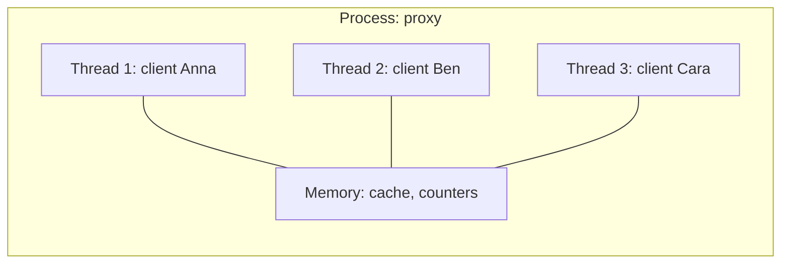

One process = one memory space. Threads = workers **sharing that one
memory**. Sharing is the power (all see the same cache) and the entire
problem (all can corrupt the same cache).

### 3.2 Why the proxy needs threads

One thread serving three clients, one of them slow:

```mermaid
gantt
    title Single thread: slow client blocks everyone
    dateFormat X
    axisFormat %s
    section Server
    Serve Anna (fast)   : 0, 1
    Wait for slow Ben   : 1, 6
    Serve Cara (fast, waited!) : 6, 7
```

One thread per client — everyone progresses independently:

```mermaid
gantt
    title One thread per client
    dateFormat X
    axisFormat %s
    section Anna
    done : 0, 1
    section Ben
    slow fetch : 1, 6
    section Cara
    done : 1, 2
```

### 3.3 How a thread is born here (annotated)

```c
sock_t *pfd = malloc(sizeof *pfd);   /* (a) heap box for the fd */
*pfd = client;                        /* (b) put the fd inside   */
pthread_create(&tid, NULL, handle_client, pfd);  /* (c) start thread, hand it the box */
pthread_detach(tid);                  /* (d) "clean yourself up on exit, no join" */
```

Why the malloc dance (a–b)? The new thread needs the fd, but the accept
loop's local `client` variable gets **overwritten by the next `accept`**
immediately. Passing `&client` (a pointer to that reusable slot) is the
classic race: thread reads it *after* it changed. A private heap box
per thread kills the race. The thread `free`s the box first thing.

### 3.4 Race conditions: the broken counter

Two threads each run `active_clients++` once. `++` is really:

```
(1) read  value into CPU register
(2) add 1
(3) write value back
```

Interleaving that loses an update:

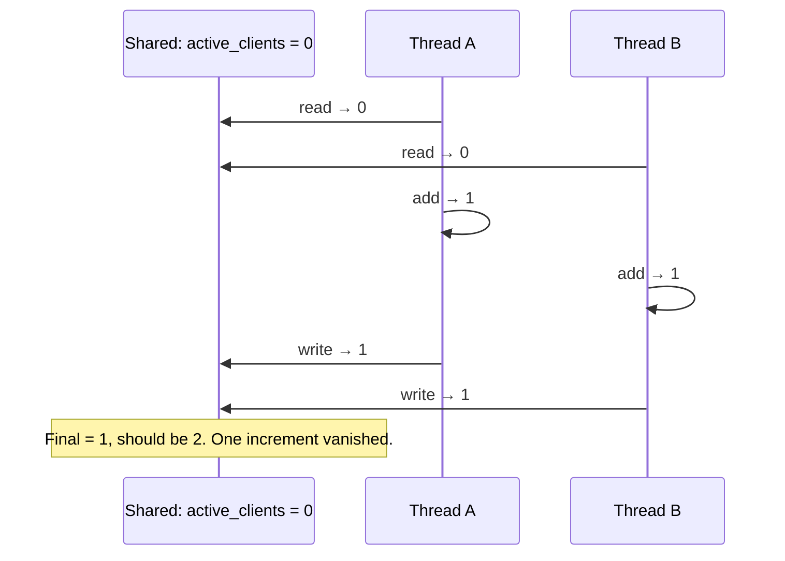

No crash, no warning — just quietly wrong. This class of bug is why
locks exist. (Try it: temporarily guard nothing, spam 200 parallel
requests at a debug counter — counts come out short.)

### 3.5 What is shared vs private in our proxy

```
SHARED (lock needed)          PRIVATE per thread (no lock)
─────────────────────         ────────────────────────────
cache_head, cache_total       client socket fd
  → guarded by cache_lock     request/response buffers
active_clients                ParsedRequest of this client
  → guarded by active_lock    upstream connection
```

If in doubt: *"can two threads touch it?"* → lock.

---

## Part 4 — Mutex in depth

### 4.1 What it is

A mutex has two states:

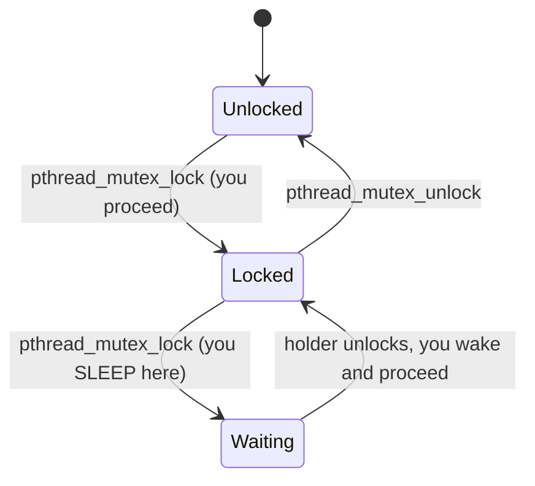

`lock` = "wait until it's mine, then take it". `unlock` = "hand it to
the next waiter". Code between them = **critical section** (runs as if
single-threaded).

### 4.2 The pattern, smallest possible

```c
pthread_mutex_lock(&cache_lock);    /* take (or sleep until you can) */
/* ... touch shared data, quickly ... */
pthread_mutex_unlock(&cache_lock);  /* hand over */
```

### 4.3 Walk-through: `cache_lookup`

```c
pthread_mutex_lock(&cache_lock);          /* enter alone */
for (e = cache_head; e; e = e->next)      /* walk the list safely */
    if (match) {
        copy = malloc(...); memcpy(...);  /* COPY under lock… */
        e->lru = time(NULL);
        found = 1; break;
    }
pthread_mutex_unlock(&cache_lock);        /* …so after unlock, */
send_all(client, copy, ...);              /* the slow network send */
free(copy);                               /* is 100% lock-free.    */
```

Two deliberate choices: (1) copy-then-unlock means an eviction a
microsecond later can't pull bytes from under the sender — no dangling
pointer, ever. (2) The lock is held for microseconds (memory scan),
never for network seconds — otherwise 100 threads would queue behind
one slow fetch.

### 4.4 Walk-through: the client counter

Accept loop: `lock → while full: wait → active_clients++ → unlock`.
Thread exit: `lock → active_clients-- → signal → unlock`. The `--`
without a lock would be the §3.4 bug wearing a trenchcoat.

### 4.5 Rules that prevent pain

1. **Short sections.** Locks serialize — every microsecond inside
   multiplies across threads.
2. **Always unlock, every path** (including `return`/`break` inside —
   count them when reviewing).
3. **Never lock the same non-recursive mutex twice** in one thread —
   instant self-deadlock (it sleeps waiting for itself).
4. **Fixed lock order.** Deadlock needs two locks taken in opposite
   orders by two threads:

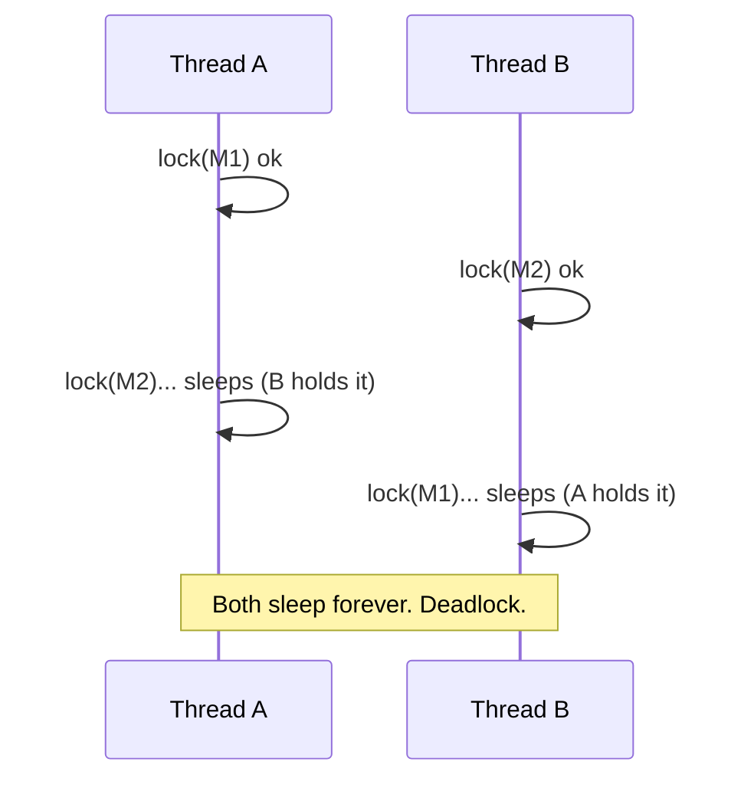

Our design sidesteps it: `cache_lock` and `active_lock` are **never
held at the same time** anywhere. One lock at a time = deadlock
impossible.

---

## Part 5 — Condition variables in depth

### 5.1 Why a mutex alone cannot wait

The accept loop must pause while 100 clients run. Options without a
condvar: spin (`while full: sleep(1); re-check`) — wakes 100×/sec to do
nothing, and reacts up to a second late. A condition variable is a
**waiting room with a doorbell**: sleep with zero CPU until someone
rings.

### 5.2 `wait` / `signal` anatomy

```c
/* WAITER (accept loop): */
pthread_mutex_lock(&active_lock);
while (active_clients >= MAX_CLIENTS)
    pthread_cond_wait(&active_cond, &active_lock);
    /* atomically: unlock + sleep. On wakeup: re-locked before return. */
active_clients++;
pthread_mutex_unlock(&active_lock);

/* SIGNALLER (finishing thread): */
pthread_mutex_lock(&active_lock);
active_clients--;
pthread_cond_signal(&active_cond);   /* ring: "re-check your condition" */
pthread_mutex_unlock(&active_lock);
```

Three subtleties that confuse everyone once, then never again:

1. **`wait` needs the mutex held**, then *releases it while sleeping*
   (otherwise the signaller could never lock to decrement — permanent
   sleep). Releasing + sleeping is one atomic step; nothing slips
   between.
2. **`while`, not `if`.** Wakeups can be *spurious* (OS wakes you with
   no signal) and another waiter may have grabbed the freed slot first.
   Re-checking the condition in a loop makes both harmless.
3. **`signal` wakes *one* waiter** (`broadcast` wakes all — we'd use it
   if many slots freed at once; here one thread frees exactly one slot,
   so `signal` is precise).

### 5.3 Full trace — the 101st client

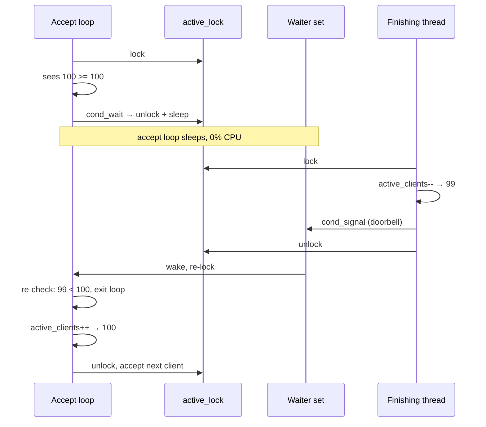

---

## Part 6 — Semaphores (and why we faked one)

### 6.1 The concept in 30 seconds

A semaphore = **counter + atomic wait/signal**:

- `wait`: while counter == 0, sleep; else counter-- and proceed.
- `signal`: counter++ and wake a sleeper.

Compare §5.2: our `active_clients` + `while(>=MAX) wait` + `--/signal`
is *literally* a semaphore with 100 tokens ("you may run" permits).
A mutex is just a semaphore with 1 token.

### 6.2 The textbook version we did NOT use

```c
sem_t slots;
sem_init(&slots, 0, MAX_CLIENTS);  /* counter starts at 100 */
// accept loop:  sem_wait(&slots);   /* take a token (sleeps if 0) */
// thread exit:  sem_post(&slots);   /* return the token */
```

Shorter — and broken on macOS, which never implemented *unnamed*
POSIX semaphores (`sem_init` exists but doesn't work). Our mutex+cond
trio behaves identically and works on Linux, macOS, and Windows
(pthreads-w32). Same semantics, portable parts.

---

## Part 7 — Network diagrams

### 7.1 TCP 3-way handshake — where our calls sit

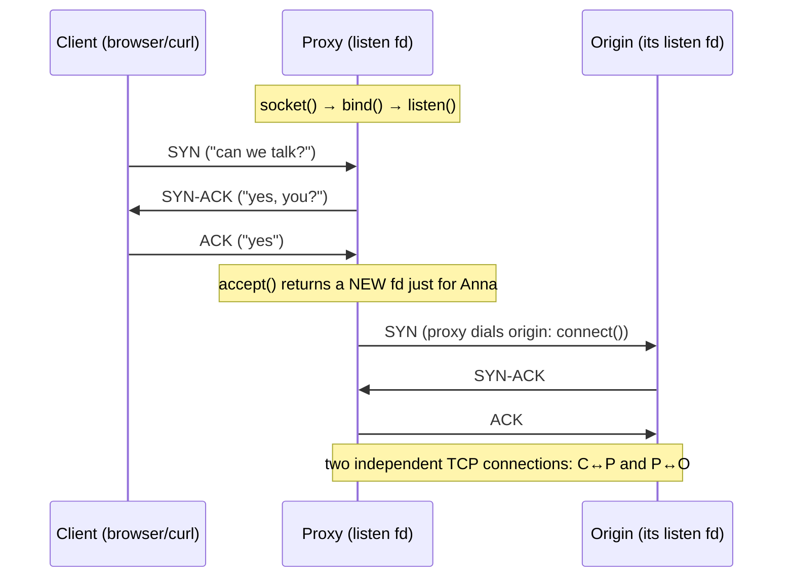

Two things beginners mix up: (1) the **listen fd never carries data** —
`accept()` mints a fresh fd per client; (2) proxy↔origin is a *second*,
separate connection. The proxy glues bytes between them.

### 7.2 HTTP on top of TCP — and why `Connection: close`

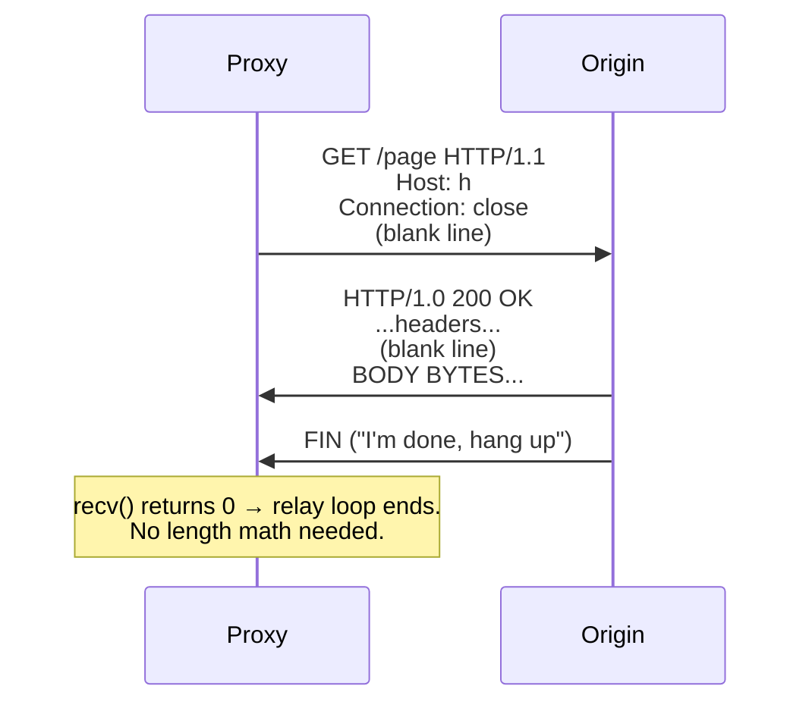

HTTP has no "message ends here" marker on the wire — with
`Connection: close` the server's hang-up *is* the terminator, which is
why our relay loop is just "forward until `recv` returns 0". (Keep-alive
would need Content-Length/chunked framing — listed as future work.)

### 7.3 GET miss, full sequence

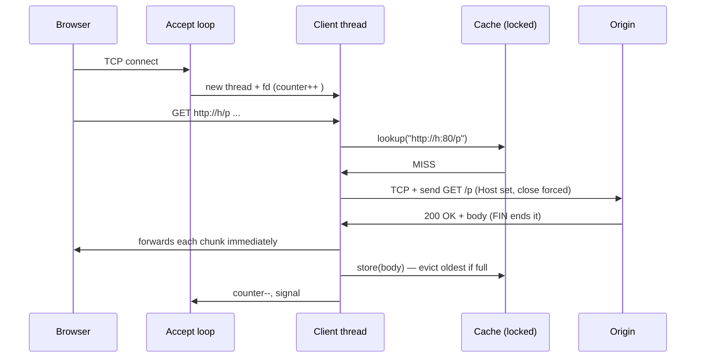

### 7.4 GET hit — the whole thing

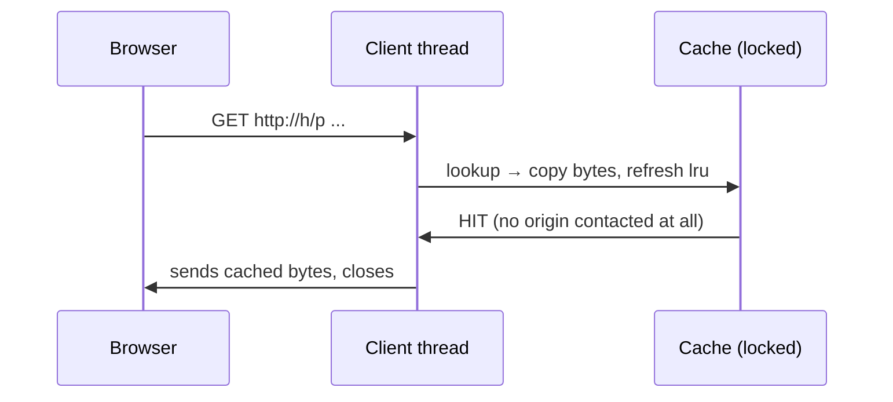

Origin can be *dead* and this still returns 200 — the test that proves
caching is real.

### 7.5 CONNECT tunnel

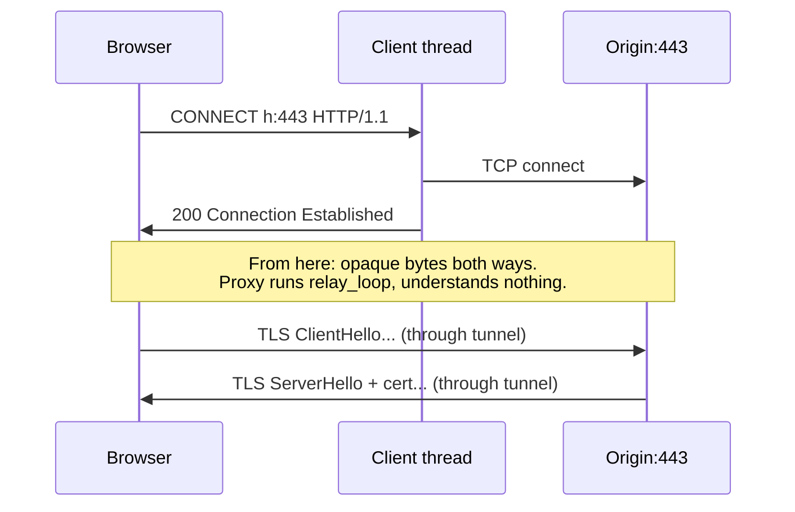

### 7.6 TLS handshake in depth (proxy as the TLS client)

For `GET https://…`, the proxy itself performs this with the origin
*before* any HTTP flows — via `upstream_connect()`:

```mermaid
sequenceDiagram
    participant P as Proxy (OpenSSL client)
    participant O as Origin:443
    P->>O: ClientHello (+SNI: "looking for h")<br/>〔SSL_set_tlsext_host_name〕
    O->>P: ServerHello, Certificate("I am h"), "prove yourself done"
    Note over P: Verify, two independent checks:<br/>1. Chain: cert signed by a CA in the<br/>&nbsp;&nbsp;&nbsp;&nbsp;system bundle? 〔default_verify_paths〕<br/>2. Name: cert names THIS host? 〔SSL_set1_host〕<br/>Either fails → handshake aborts → client gets 502
    P->>O: key exchange + "let's switch to encrypted"
    O->>P: "agreed" (Finished)
    Note over P,O: Everything after this is ciphertext.<br/>Proxy sends GET, reads reply via SSL_read.
    O->>P: close_notify ("hanging up securely")
    Note over P: SSL_read returns 0 — our end-of-body,<br/>mirroring TCP FIN.
```

Jargon decoder: **SNI** = the hostname sent *in the clear* inside
ClientHello so one IP serving 100 sites picks the right cert.
**close_notify** = TLS's polite hang-up (vs TCP FIN's abrupt one).
**`SSL_CERT_FILE`** env = "trust this extra CA file" without rebuilding
(how the self-signed lab test passes verification).

### 7.7 `select()` relay loop

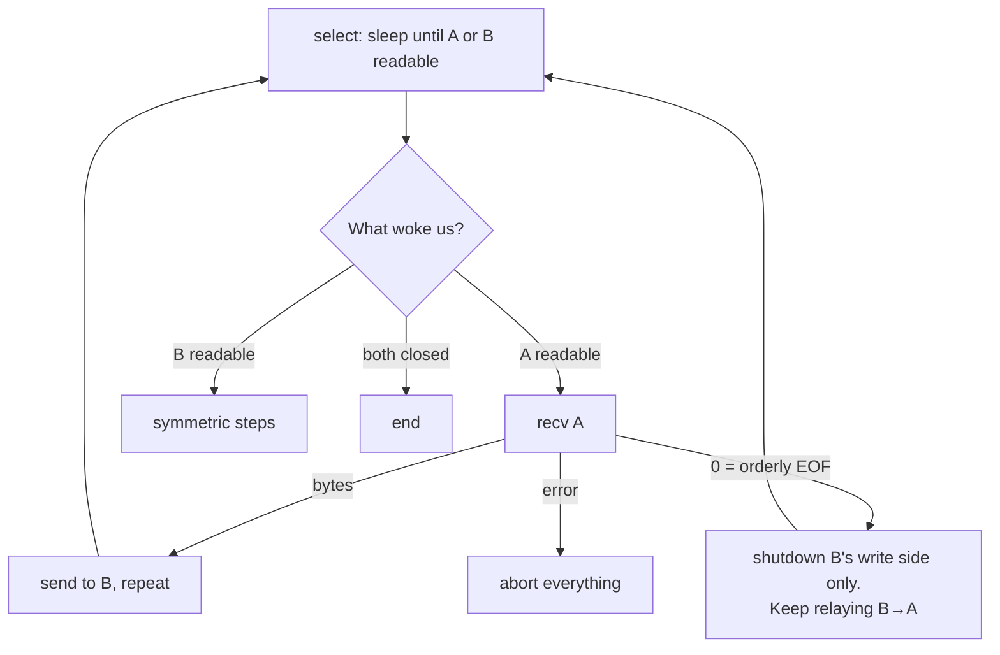

The half-close branch (`HA`) is the subtle one: tools like `nc` shut
their write side after sending yet still expect a reply — killing the
whole tunnel on first EOF (the naive version) drops pipelined answers.
EOF on A ⇒ `shutdown(B, WR)` ⇒ B→A keeps flowing until B also ends.

### 7.8 Cache before/after a store-with-eviction

Cache holds 2 entries, 1 MB cap, currently 900 KB. A 300 KB page arrives:

```
BEFORE (900 KB)                    AFTER (800 KB)
┌──────────────┐                   ┌──────────────┐
│ A  500K lru=9│ (newest, keep)    │ A  500K lru=9│
├──────────────┤                   ├──────────────┤
│ B  400K lru=3│ (oldest, EVICT)   │ C  300K lru=10│ (new page)
└──────────────┘                   └──────────────┘
900+300 > 1024 → evict B → 500+300 fits.
```

That loop (`while full: evict`) is `cache_store()`'s middle.

---

## Part 8 — One GET miss, traced through real functions

1. `main` → `accept()` returns fd 7 → counter 12→13 → `pthread_create`
   → `handle_client(fd 7)`.
2. `handle_client` → `recv_headers()` returns `"GET http://h/p …"` (87
   bytes) → not CONNECT → `handle_get()`.
3. `ParsedRequest_create` + `ParsedRequest_parse` → `method=GET`,
   `host=h`, `port=NULL`, `path=/p`, `protocol=http`.
4. `cache_key` → `"http://h:80/p"`. `cache_lookup` → MISS.
5. `upstream_connect(h, "80", tls=0)` → `connect_remote` dials,
   `fd=9`, no TLS → returns.
6. `Host` added, `Connection: close` forced, `Proxy-Connection`
   stripped → `unparse` → `"GET /p HTTP/1.1\r\n…"` → `upstream_send`.
7. Loop `upstream_recv` → `send_all(client)` each chunk + accumulate →
   server FIN → `cache_store` → close, counter 13→12, signal, thread
   exits, fd closed.

Every name above is a real function you can open. Put a `fprintf` at
each step once and watch a request walk through — best hour you'll
spend on this codebase.

---

## Part 9 — Try it yourself (safe experiments)

1. **Feel the cap.** Set `MAX_CLIENTS 1`, rebuild, fire 3 parallel
   `curl`s with `time`. Total ≈ sum of parts: serialization you can
   feel. Set it back.
2. **Watch eviction.** Add one `fprintf(stderr, "evict %s\n", …)` in
   `cache_evict_lru_locked`, set `MAX_CACHE_SIZE` tiny (e.g. 2 KB),
   fetch two pages. Evictions appear on cue. Remove the print after.
3. **Break verification on purpose.** Run the §9 TLS lab *without*
   `SSL_CERT_FILE` → every https fetch 502s. That 502 is the sound of
   authentication working.
4. **See threads exist.** While 10 parallel slow requests run:
   `ps -M <proxy-pid> | wc -l` (macOS) — count the threads.
5. **Kill the origin mid-project.** Cache HITs still return 200. Say
   out loud *why* (no origin contacted — §7.4). If you can explain that
   sentence, you understand the proxy.

---

## Part 10 — Glossary (one line each)

- **struct** — named box of variables traveling together.
- **`->`** — `(*p).field`, field access through a pointer.
- **`typedef`** — nickname for a type; changes nothing else.
- **heap** — memory you request (`malloc`) and must return (`free`).
- **linked list** — nodes chained by `next` pointers; grow/shrink anywhere.
- **process** — running program with its own memory.
- **thread** — worker sharing its process's memory.
- **race condition** — two threads interleaving on shared data → silently wrong.
- **critical section** — code that must run as if single-threaded.
- **mutex** — one-token lock; holder proceeds, rest sleep.
- **condition variable** — waiting room with doorbell; efficient sleep till signalled.
- **spurious wakeup** — woken with no signal; reason for the `while` loop.
- **semaphore** — counter-based cousin of mutex; ours is hand-rolled (§6).
- **deadlock** — threads waiting on each other forever; avoided via one-lock-at-a-time.
- **detached thread** — self-cleaning thread; no `join` needed.
- **socket/fd** — integer handle for a network connection.
- **listen fd** — doorbell socket; `accept()` mints per-client fds from it.
- **`getaddrinfo`** — DNS + service lookup returning dialable addresses.
- **`select()`** — sleep until one of many fds is readable/writable.
- **half-close** — shutting one direction (`shutdown WR`) while the other flows.
- **FIN** — TCP hang-up; `recv` returning 0.
- **absolute-form vs origin-form** — `GET http://h/p` (to proxy) vs `GET /p` (to origin).
- **SNI** — cleartext hostname in ClientHello for cert selection.
- **hostname verification** — cert must name the host you asked for.
- **CA bundle** — list of trusted certificate authorities.
- **`close_notify`** — TLS's polite hang-up.
- **LRU** — evict least-recently-used first, via per-entry timestamps.
- **`send_all`** — looped `send` until all bytes are out (one call rarely suffices).
- **preprocess/compile/link** — paste headers → translate each `.c` → stitch `.o`s into a program.
- **declaration vs definition** — promise (`int f();`) vs the actual code.
