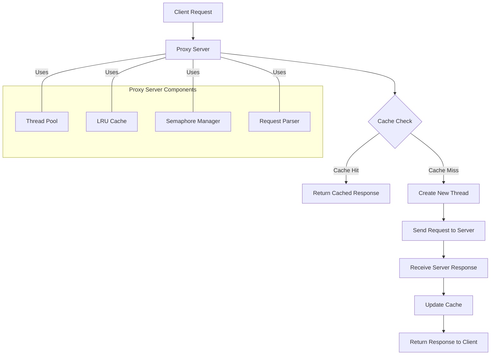

# Multi-Threaded Proxy Server with Cache

A high-performance proxy server implementation in C with support for caching and multi-threading. This project demonstrates key concepts of network programming, concurrent processing, and caching mechanisms.

## Features

- Multi-threaded architecture for handling concurrent client requests
- Built-in caching system with LRU algorithm
- Support for HTTP/HTTPS protocols
- Thread-safe operations using semaphores and mutex locks
- Configurable cache size and connection parameters
- Request encryption for enhanced security

## Architecture

The proxy server implements a multi-threaded design where:

- Each client connection is handled by a separate thread
- Semaphores manage thread synchronization
- Cache operations are protected by mutex locks
- LRU algorithm optimizes cache performance

### UML Diagram



This diagram illustrates the flow of requests through the proxy server and its main components.

## Prerequisites

- GCC Compiler
- POSIX-compliant system
- Make build system
- Basic understanding of networking concepts

## Installation

```bash
git clone https://github.com/tejasvi541/proxy-server
cd multi-threaded-proxy
make all
```

## Usage

1. Start the proxy server:

```bash
./proxy <port_number>
```

2. Configure your browser/client to use the proxy:
   - Host: localhost
   - Port: <specified_port_number>

## Configuration

The following parameters can be modified in `config.h`:

- MAX_CACHE_SIZE
- MAX_THREADS
- CONNECTION_TIMEOUT
- BUFFER_SIZE

## Limitations

- Only HTTP/HTTPS protocols supported
- Cache size limited by available memory
- Multiple clients accessing same URL will receive separate cached responses
- Fixed-size cache elements

## Contributing

1. Fork the repository
2. Create your feature branch
3. Commit your changes
4. Push to the branch
5. Open a Pull Request

## Author

- [@tejasvi541](https://github.com/tejasvi541)
- Inspired by [@AplhaDecodeX](https://github.com/AlphaDecodeX/MultiThreadedProxyServerClient)

## License

This project is licensed under the MIT License - see the [LICENSE](LICENSE) file for details.
