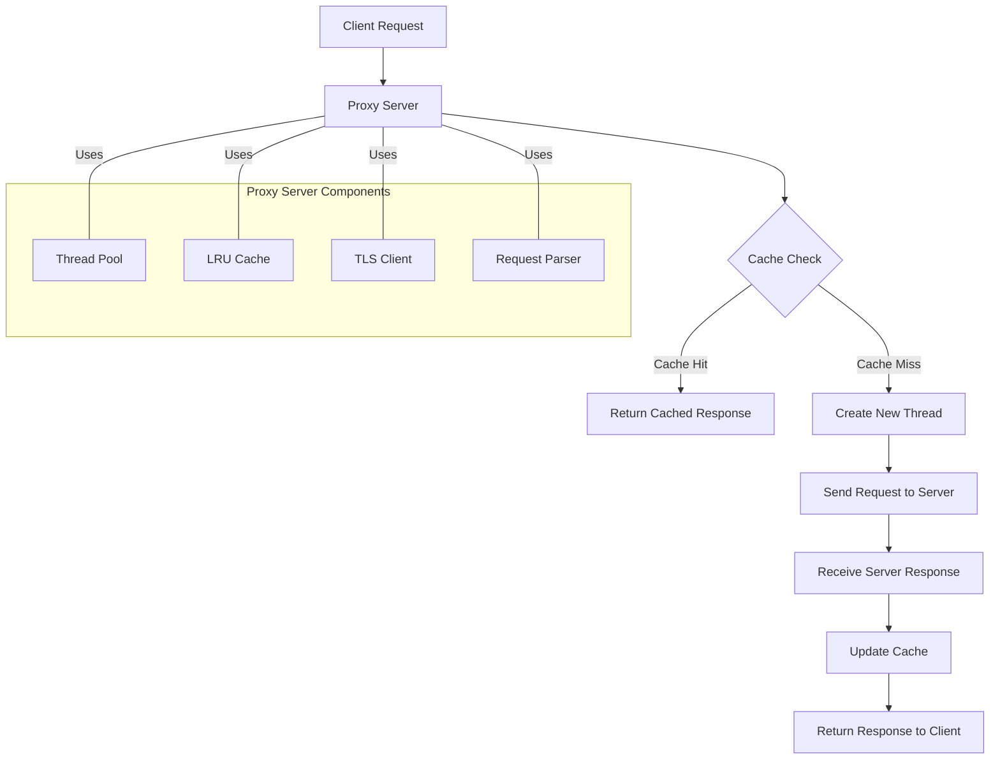

# Multi-Threaded Proxy Server with Cache

A high-performance proxy server implementation in C with support for caching and multi-threading. This project demonstrates key concepts of network programming, concurrent processing, and caching mechanisms.

## Features

- Multi-threaded architecture for handling concurrent client requests
- Built-in caching system with LRU algorithm
- HTTP forwarding with caching, plus HTTPS origin fetch over verified TLS
- CONNECT tunneling relays encrypted HTTPS bytes without decrypting them
- Thread-safe operations using mutexes and condition variables
- Configurable cache size and connection parameters

## Architecture

The proxy server implements a multi-threaded design where:

- Each client connection is handled by a separate thread
- A mutex + condition variable caps concurrency at MAX_CLIENTS
- Cache operations are protected by mutex locks
- LRU algorithm optimizes cache performance

### UML Diagram


```mermaid
graph TD
    A[Client Request] --> B[Proxy Server]
    B --> C{Cache Check}
    C -->|Cache Hit| D[Return Cached Response]
    C -->|Cache Miss| E[Create New Thread]
    E --> F[Send Request to Server]
    F --> G[Receive Server Response]
    G --> H[Update Cache]
    H --> I[Return Response to Client]

    subgraph Proxy Server Components
    J[Thread Pool]
    K[LRU Cache]
    L[TLS Client]
    M[Request Parser]
    end

    B ---|Uses| J
    B ---|Uses| K
    B ---|Uses| L
    B ---|Uses| M
```

This diagram illustrates the flow of requests through the proxy server and its main components.

## Prerequisites

- C compiler (GCC, Clang, or MSVC)
- POSIX-compliant system (Linux, macOS) — Windows builds via Visual Studio
- Make build system (macOS/Linux)
- OpenSSL 1.1+ for HTTPS origin fetch — optional; without it the proxy
  still builds and serves HTTP, and `https://` URLs return 501
- Basic understanding of networking concepts

### macOS

Yes — macOS is fully supported. You need Xcode command line tools and
Homebrew OpenSSL:

```bash
xcode-select --install
brew install openssl
```

`make` auto-detects Homebrew OpenSSL (Apple Silicon and Intel paths).
Without OpenSSL it still builds: `make TLS=0` forces the plain-HTTP build.

### Linux

```bash
sudo apt install build-essential libssl-dev   # Debian/Ubuntu
```

## Installation

```bash
git clone https://github.com/tejasvi541/proxy-server
cd proxy-server
make all          # TLS on if OpenSSL found, else plain HTTP
make TLS=0        # force plain-HTTP build (no OpenSSL needed)
```

## Usage

1. Start the proxy server (default port 8080):

```bash
./proxy 8080
```

You should see:

```
proxy listening on port 8080 (GET cache + CONNECT tunnel, https origins via TLS)
```

(The trailer says `no TLS: https origins get 501` on a plain build.)

2. Send traffic through it:

```bash
# HTTP via proxy (uses cache on repeat requests)
curl -x http://127.0.0.1:8080 http://example.com/

# HTTPS URL fetched by the proxy itself over verified TLS, then cached
curl -x http://127.0.0.1:8080 https://example.com/
```

3. Or configure your browser/OS to use the proxy:
   - Host: localhost
   - Port: 8080 (browsers use CONNECT for https sites — tunneled, not cached)

Private CA (lab/self-signed origins only): point OpenSSL at your CA file:

```bash
SSL_CERT_FILE=/path/to/my-ca.pem ./proxy 8080
```

## Configuration

The following parameters can be modified in `proxy_server.c`:

- MAX_CACHE_SIZE
- MAX_ELEMENT_SIZE
- MAX_CLIENTS
- BUFFER_SIZE

## Limitations

- Only GET requests are forwarded (others get 501); one request per connection
- Only `200 OK` responses are cached; no `Cache-Control`/`ETag` handling
- CONNECT tunnels are relayed, never cached
- Fixed 4 MB cache / 512 KB per entry (tunable via `#define`s)

## Contributing

1. Fork the repository
2. Create your feature branch
3. Commit your changes
4. Push to the branch
5. Open a Pull Request

## Author

- [@tejasvi541](https://github.com/tejasvi541)
- Inspired by [@AplhaDecodeX](https://github.com/AlphaDecodeX/MultiThreadedProxyServerClient)

## License

This project is licensed under the MIT License - see the [LICENSE](LICENSE) file for details.
